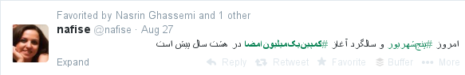

+++
title = "8th anniversary of 1MillionSignatures campaign for equal women rights in Iran; the Tweets."
description = "People who lived the 1 million signatures for equal rights of women in Iran, tweeting their feeling and ideas after 8 years."
date = 2014-08-29T06:49:34.726Z
tags = []
medium = "https://medium.com/@jadi/8th-anniversary-of-1millionsignatures-campaign-for-equal-women-rights-in-iran-the-tweets-5f4198dd772e"
+++

## 8th anniversary of 1MillionSignatures campaign for equal women rights in Iran; the Tweets by people who lived it

Eight years ago, a movement started in Iran. The movement was called **1 Million Signatures** Campaign. Most people believe that collecting a signature from 1/70th of the whole population of Iran is impossible but the defense was strong:

- This will show people that working during Ahmadinejad is possible and we should not be afraid of the situation and push back.
- This is will help us to go on the streets and talk with people. It was decided to forbid people from collecting any signature without speaking with the signee, discussing the discriminatory law and give them a booklet regarding all these issues. In other words, reaching 1M milestone was not the goal; speaking with the people on the street was. We were not even sure what should be done with the signatures if we reach the 1M ! Many people opposed going to the *parliament* and *asking* them for change.

Anyway… after all the arrests, tortures, crackdown, women rights workshops in different provinces, all the highlighting of women issues in public opinion and and all the people who used tho *opportunity* to leave the country as “1 Million Signatures” activists, yesterday was its 8th anniversary. Nobody knows how many signatures are collected because many of them are hidden while police vans were parked in front of the houses of the volunteers who were offering their houses for 1MilloinSignaturesCampaign meetings. Yesterday [@nafise](http://twitter.com/nafise) on tweeted:

***Today is 27th of Aug, 8th anniversary of 1MillionSignaturesCampaign***

And a small group of 1MSC activist who stayed active and inside the country despite all the problems and continued the campaign, started writing about their view on the issue. Among them [@nafise](http://twitter.com/nafise), [@pardalan](http://twitter.com/pardalan), [@raaha](http://twitter.com/raha), @[azadwit](http://twitter.com/azadwit), @[sussantweets](http://twitter.com/sussantweets), @[bolexnotes](http://twitter.com/bolexnotes), @[sh0ra](http://twitter.com/sh0ra), [@emaadb](http://twitter.com/emaadb), [@elnaz_nsr](http://twitter.com/elnaz_nsr), . I found it useful to translate them and give you an insider view to the Iran’s 1 [Million Signatures Campaign](http://en.wikipedia.org/wiki/One_Million_Signatures).

So here are the tweets hashtags 1MillionSignaturesCampaign ([https://twitter.com/hashtag/کمپین‌یک‌میلیون‌امضا](https://twitter.com/hashtag/کمپین‌یک‌میلیون‌امضا) ) in chronological order.

[@nafise](http://twitter.com/nafise)
*today is 27th Aug, the 8th anniversary of 1 Million Signatures Campaign.*

[@nafise](http://twitter.com/nafise)
*for me, the 1 Million Signatures Campaign started from [@pardalan](http://twitter.com/pardalan) house, I went and rang thinking that is the 1MSCs office.*

[@nafise](http://twitter.com/nafise)
*I collected signatures at the Tehran-Karaj metro. A woman shouted: Liers ! These laws can not be the current laws.*

[@nafise](http://twitter.com/nafise)
*The weirdest signature I did not took was a woman who was the seccond-wife herself. She was OK with polygamy.*

[@nafise](http://twitter.com/nafise)
*I became an activist by 1 Million Signatures Campaign. I learned to speak with people on the streets.*

[@nafise](http://twitter.com/nafise)
*I facilitated the first workshop on discriminatory laws on spring 2007*

[@nafise](http://twitter.com/nafise)
*After joining the 1 Million Signatures Campaign, I lost a few friends, including 4 or 5 of my closer ones.*

[@nafise](http://twitter.com/nafise)
*I used to adore Noushin Ahmadi Khorasani before the 1 Million Signatures Campaign. She attacked me harshly on one of 12th of June meetings at Khadije Moghadam’s house.*

[@nafise](http://twitter.com/nafise)
*My first arrest was at KhorramAbad (city) workshops. Police raided with machine guns in hand.*

[@nafise](http://twitter.com/nafise)
*After the arrest we were interrogate and threatened at the Intelligence Ministary’s station. They let us go at the midnight and we returned back to Tehran.*

[@jadi](http://twitter.com/jadi)
*For me one of the most valuable lessons of 1 Million Signatures Campaign was the fact that some people are always looking for their own benefit — despite putting others in danger.*

[@jadi](http://twitter.com/jadi)
*IMO it is good if all people write their memories of 1 Million Signatures Campaign. It was a brave useful act during Ahmadinejads years.*

[@nafise](http://twitter.com/nafise)
*No exaggeration! I spend 8 — 10 hours a day for one year for 1 Million Signatures Campaign activities.*

[@nafise](http://twitter.com/nafise)
*For the 1st anniversary of the 1 Million Signatures Campaign, a survay with 2000 participants conducted in Tehran.*

[@nafise](http://twitter.com/nafise)
*before 2009 [Ahmadinejad relection and green movement protest against his cheatings] and before [@pardalan](http://twitter.com/pardalan) leaving Iran, her house was the main place for official and unofficial gatherings. The house is the place of MANY memories.*

[@nafise](http://twitter.com/nafise)
*My twitter account was made at [@pardalan](http://twitter.com/pardalan) house by [@sh0ra](http://twitter.com/sh0ra) . We were sitting on her bed.*

[@pardalan](http://twitter.com/pardalan)
*I’m believing more and more that whatever I’m doing is due to what I earned / learned at the 1 Million Signatures Campaign.*

[@pardalan](http://twitter.com/pardalan)
*That house (my house) will be the treasure chest of all our memories.*

[@raaha](http://twitter.com/raaha)
*The day I went to the Ra’ad Instutute [the first day of 1 Million Signatures Campaign; The start was going to be announced at Ra’ad Instututu but police did not let people to enter] nobody knew me but I knew most of the people from their photos.*

[@raaha](http://twitter.com/raaha)
*Maryam emailed me and we fixed a meeting for Media team. We went to the Nobel Cafe. Me, Farnaz, Maryam Mirza and Maryam*

[@raaha](http://twitter.com/raaha)
*I told Maryam Hosseinkhah that I’m not that good at photographing. She told me that no one were that good when they started.*

[@pardalan](http://twitter.com/pardalan)
*One day at my house Amir ([@sh0ra](http://twitter.com/sh0ra)) was trying to rescue a trapped crow and attacked by the parents!*

[@raaha](http://twitter.com/raaha)
*My first arrest was the valentine night of 2009 at the Daneshjoo Park with Nasim.*

[@raaha](http://twitter.com/raaha)
*When I was arrested, [@pardalan](http://twitter.com/pardalan) was following the police car, how she could do that?*

[@pardalan](http://twitter.com/pardalan)
*One of the worst arrests where the one in which Mahboobe told us that two of the arrestees are arrested and tortured.*

[@pardalan](http://twitter.com/pardalan)
*Those two [above tweet] where Nasim and [@Raaha](http://twitter.com/Raaha) . We got a call to newspaper and someone told us that he hears their shouting and screaming from the prison.*

[@azadwit](http://twitter.com/azadwit)
*First time I entered the campaign, [@ChaySig](http://twitter.com/ChaySig) tought I’m a homeless!*

[@raaha](http://twitter.com/raaha)
*One day I cried at [@pardalan](http://twitter.com/pardaln) house and told her “you only count the people who write!”. I wonder how she did not got mad at me.*

[@raaha](http://twitter.com/raaha)
*when Tara told me about the 1 Million Signatures Campaign’s backstage and all the struggles, i said “Oh my!” and the perfect image I had, was gone.*

[@raaha](http://twitter.com/raaha)
*And there were people who were adding some rude words to the campaign after ANY criticism they had from ANYONE.*

[@pardalan](http://twitter.com/pardalan)
*The vertical organization of the 1 Million Signatures Campaign was the best model we kept successfully.*

[@nafise](http://twitter.com/nafise)
*We used to collect around 600 signatures in one day at hiking places. Then the arrest started.*

## [@elnaz_nsr](http://twitter.com/elnaz_nsr)
*I was @Nafise and Aydas roommate. Were collecting signatures at the hiking places and they arrested @Nafise. 3 days later they raided the house:*

[@azadwit](http://twitter.com/azadwit)
*Although the 1 Million Signatures Campaign days was one of my bests, I never had / have “How I miss those days” nostalgic feeling for it.*

[@raaha](http://twitter.com/raaha)
*The vertical structure of the campaign was great but unfortunately it started to become a struggle for power and petty dictatorships.*

[@raaha](http://twitter.com/raaha)
*I can name people whom was not part of these small groups and faded out after a while.*

[@raaha](http://twitter.com/raaha)
*The crackdown and security issues made people far from each other. You would miss the anniversary gathering if you were not checking your email by daily basis.*

[@raaha](http://twitter.com/raaha)
*One day a woman gave me back the paper unsigned and told me “I’ve already signed a better version”!*

[@raaha](http://twitter.com/raaha)
*I designed the 8th of March poster and [@Nafise](http://twitter.com/Nafise) said there is no need to update the site for while, we celebrated! [ site is [http://signforchange.info/english/](http://signforchange.info/english/) ]*

[@raaha](http://twitter.com/raaha)
*[@Nafise](http://twitter.com/Nafise) had to go to the judge, we gathered at her house during the night with Mehran and [@pardalan](http://twitter.com/pardalan).*

[@raaha](http://twitter.com/raaha)
*Mehran did a lot for the campaign without trying to become famous.*

[@azadwit](http://twitter.com/azadwit)
*I believe its a huge mistake if women rights movement goes toward the useless NGO path [In iran there is no real NGO] after all the 1 Million Signatures Campaign heritage.*

[@elnaz_nsr](http://twitter.com/elnaz_nsr)
*I was knocking on Naser Zarafshan’s door for 6 months! He signed the 1 Million Signatures Campaign but never participated in an interview and did not let others to sign.*

[@elnaz_nsr](http://twitter.com/elnaz_nsr)
*[based on my last tweet] I was thinking that 2 leftist lawyers are more important than people on the street.*

[@azadwit](http://twitter.com/azadwit)
*Although the 1 Million Signatures Campaign’s structure had many mistake and problems but it should be a base for improvement and optimization.*

[@sussantweets](http://twitter.com/sussantweets)
*Despite Campaign’s supporters its activists were alone especially w/arrests. Few are eager to help w/grunt work.*

[@sussantweets](http://twitter.com/sussantweets)
*Campaign’s Invisible street theater a creative strategy 4bringing social/legal problems i.e.polygamy 2life*

[@sussantweets](http://twitter.com/sussantweets)
*On anniversary of Campaign, remembering Bahareh Alavi, brave young activist who is no longer w/us.*

[@sussantweets](http://twitter.com/sussantweets)
*On anniversary of Campaign remembering Bahareh Hedayat serving 10yr prison sentence 2yrs for women’s rights protest.*

[@bolexnotes](http://twitter.com/bolexnotes)
*FeminstSchool [ A branch from 1 Million Signatures Campaign ] showed that they never understood feminism or Animal Farm by claiming that “some are more equal than others” in a note.*

[@elnaz_nsr](http://twitter.com/elnaz_nsr)
*1 Million Signatures Campaign showed us that the 1 Million is a Huge number.*

[@elnaz_nsr](http://twitter.com/elnaz_nsr)
*Delaram was pretending to be a cab driver and I was pretending to be a passenger asking for divorce. Then talking with other passengers and encouraging them to sign the campaign. [In Iran taxis are shared]*

[@Emaadb](http://twitter.com/Emaadb)
*Socio-political activities in smaller cities were used to be the territory of reformists ONLY. 1 Million Signatures Campaign changed this.*

[@emaadb](http://twitter.com/emaadb)
*Brining the women issues to the general public and engaging the activists at other cities and provinces in a social movement was one of the best achievements of 1 Million Signatures Campaign*

[@emaadb](http://twitter.com/emaadb)
*Acting in 1 Million Signatures Campaign made many of the people I knew in Qom (a religious city) to real social activists.*

[@sh0ra](http://twitter.com/sh0ra)
*I have to recall the fact the dear Reformists never ever participated in one of the most valuable reformist movements: 1 Million Signatures Campaign.*

[@sh0ra](http://twitter.com/sh0ra)
*1 Million Signatures Campaign taught me the importance of not reproducing the power structure of the society inside our movements.*

[@elnaz_nsr](http://twitter.com/elnaz_nsr)
*1 Million Signatures Campaign is still valid. No law is changed and we still demand the change. Tunisia was the origin of our idea and it took them 10 years to change the law.*

[@emaadb](http://twitter.com/emaadb)
*We had a closet at the university and after some time it became one of the place for keeping the booklets and signatures of 1 Million Signatures Campaign.*

[@sh0ra](http://twitter.com/sh0ra)
*When I joined the 1 Million Signatures Campaign, I was 19. I started with HastiaAndish institute and their workshop on gender.*

[@sh0ra](http://twitter.com/sh0ra)
*I collected my first signatures at my home and family; telling them that an equal law will make a better relations.*

[@sh0ra](http://twitter.com/sh0ra)
*I was arrested at 2008 while I was collecting signatures at Andishe Park. I had around 10 signatures that night.*

[@sh0ra](http://twitter.com/sh0ra)
*I was jailed for 5 days at the Niloofar Security Police Station and interrogated two times for whatever I had done during my life.*

[@sh0ra](http://twitter.com/sh0ra)
*At the Niloofar Police Station I was hanged from my handcuffs. Was not able to move my hands for two weeks.*

[@sh0ra](http://twitter.com/sh0ra)
*That was why I was happy when they moved me to Evin prison. I was thinking that Evin is more controlled by laws comparing with Niloofar.*

[@sh0ra](http://twitter.com/sh0ra)
*I was kept for 25 days in Evin and interrogated 8 times. I was in solitary except the last week which passed with a con artist.*

[@sh0ra](http://twitter.com/sh0ra)
*Those days Kian Tajbakhsh was also at Evin prison. I have some unclear memories. She did not accepted the TV and was writing a lot.*

[@sh0ra](http://twitter.com/sh0ra)
*During the interrogations they were mocking me for being a feminist. They told me that a feminist man has no honor.*

[@sh0ra](http://twitter.com/sh0ra)
*I was told [during interrogations] that I’m a feminist to turn girls into communists or make some sexual friends. But I was there to change the law.*

[@sh0ra](http://twitter.com/sh0ra)
*Even outside the prison we had problems. Leftists called us reformists.*

[@sh0ra](http://twitter.com/sh0ra)
*Even inside the 1 Million Signatures Campaign, being a leftist / man was not accepted to some extends at the beginnings.*

[@sh0ra](http://twitter.com/sh0ra)
*But they accepted us. 1 Million Signatures Campaign had a great structure and we were part of the decision makings.*

[@sh0ra](http://twitter.com/sh0ra)
*I spend my first night at the prison with a group of 15 people who were arrested during a party [which is illegal in Iran]. I was segregated because I was a “security prisoner” and should not be in contact with others.*

[@sh0ra](http://twitter.com/sh0ra)
*my family stayed for 3 days in front of the security police but been told that “we do not have any info about your son”.*

[@sh0ra](http://twitter.com/sh0ra)
*Spend two night with a tailor apprentice in a cell. He had problems with his wife and those were my most real talks about the 1 Million Signatures Campaign.*

[@sh0ra](http://twitter.com/sh0ra)
*I learned there [last tweet] that poor people should be our target audience because this can free them.*

[@sh0ra](http://twitter.com/sh0ra)
*but unfortunately we targeted poor people less and less because of crackdowns on the 1 Million Signatures Campaign. We went toward the media.*

[@sh0ra](http://twitter.com/sh0ra)
*later we started the Mens Committee of 1 Million Signatures Campaign. We had a blog and were writing there.*

[@sh0ra](http://twitter.com/sh0ra)
*A great activity in 1 Million Signatures Campaign was street performances (theaters) talking about women issues. Was great and we loved peoples reactions.*

[@sh0ra](http://twitter.com/sh0ra)
*One performance was at the Saee Park and about polygamy. I was staying around to deal with unplanned problems.*

[@nafise](http://twitter.com/nafise)
*Another performance was at a bus station, about a man who was leaving the first wife for the second. Angry people attacked to beat the guy!*

[@rahaa](http://twitter.com/rahaa)
*A lot of Iranian students studying abroad came to “study” the 1 Million Signatures Campaign. We never got the results.*

[@sh0ra](http://twitter.com/sh0ra)
*From all those critics, why no one bothers to talk about the 1 Million Signatures Campaign anymore and say what nothing came after it?*

[@sh0ra](http://twitter.com/sh0ra)
*but many of the best activist were target of the sharp attacks by critics.*

[@sh0ra](http://twitter.com/sh0ra)
*The first time I collected signatures, it was at a French language class. Not much luck; streets were much better.*

## [@sh0ra](http://twitter.com/sh0ra)
*The first time I collected signatures, it was at a French language class. Not much luck; streets were much better.*

[@sh0ra](http://twitter.com/sh0ra)
*Why reformists never participated in 1 Million Signatures Campaign? Because it was a secular movement and reformists were not able to control it; they love controlling others.*

[@sh0ra](http://twitter.com/sh0ra)
*All the efforts for staying in streets were crushed by state oppression and sectarianism inside the 1 Million Signatures Campaign.*

[@sh0ra](http://twitter.com/sh0ra)
*1 Million Signatures Campaign was not able to win while there were no POLITICAL force to fight for women rights in Iran.*

[@sh0ra](http://twitter.com/sh0ra)
*What 1 Million Signatures Campaign for equal rights was able to, was brining womens issues to the general public; and did this successfully.*

[@sh0ra](http://twitter.com/sh0ra)
*After 1 Million Signatures Campaign stopped most of its activities, many new discriminatory laws are passed. Why we are not protesting anymore?*

[@azadwit](http://twitter.com/azadwit)
*for many of us being a feminist did not started with 1 Million Signatures Campaign but we it was the start of our activism.*

[@bolexnotes](http://twitter.com/bolexnotes)
*1 Million Signatures Campaign revealed that the group work is not only possible but is a must and is the only intelligent way to fight oppression, but a very difficult path to follow.*

[@sh0ra](http://twitter.com/sh0ra)
*One of the best experiences of 1 Million Signatures Campaign was the “sound of change”. Our podcast which reaching issue 7.*

[@sh0ra](http://twitter.com/sh0ra)
*In one of the Sound of Change podcasts, we asked [@pardalan](http://twitter.com/pardalan) to act as a taxi passenger :D*

For more info on 1 Million Signatures Campaign against Discriminatory laws Against Women in Iran, check its English site [http://signforchange.info/english/](http://signforchange.info/english/) and its wikipedia page [http://en.wikipedia.org/wiki/One_Million_Signatures](http://en.wikipedia.org/wiki/One_Million_Signatures).

---
*Originally published on [Medium](https://medium.com/@jadi/8th-anniversary-of-1millionsignatures-campaign-for-equal-women-rights-in-iran-the-tweets-5f4198dd772e).*
