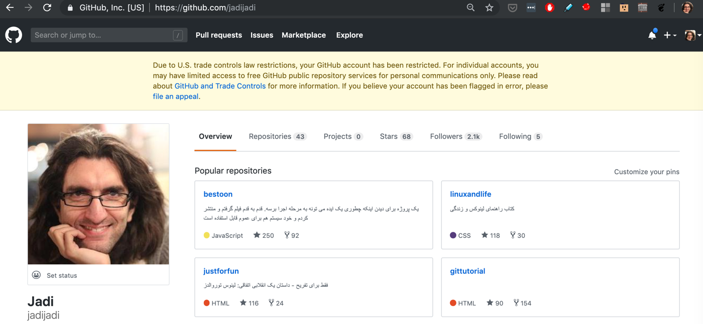
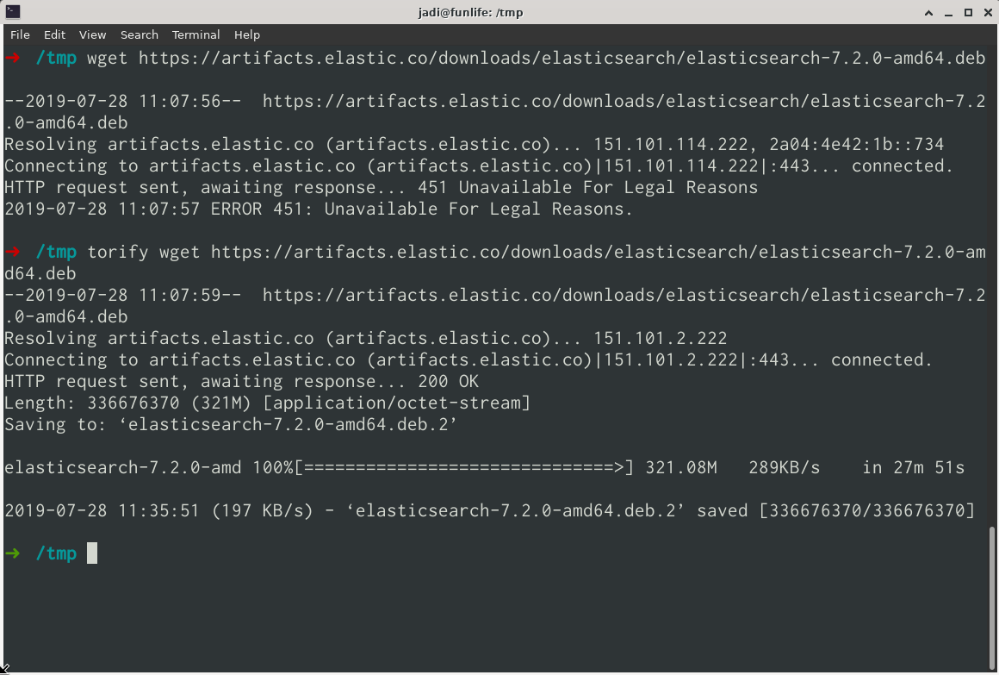

+++
title = "GitHub is limiting MANY accounts from Iran and I think its Over Acting"
date = 2019-07-28T15:01:36.273Z
tags = ["embargo", "iran", "programming", "us"]
medium = "https://medium.com/@jadi/github-is-limiting-many-accounts-from-iran-and-i-think-its-over-acting-6c1716b21be9"
+++

**UPDATE:** it seems rebuilding github.io sites, will bring them back online. thumbs up github

It was a shock. Today I’ve got many mails telling me that “your book gives me 404 errors”. You know it; 404 is “page not found”. I have written and translated 4 books and some other projects using github pages. These are static sites and 404 should be impossible, but is it?

*This is happening for MANY people*

This is happening due to US sanctions against Iran, , Crimea, Cuba, North Korea, and Syria. As much as I can say, GitHub should act based on US laws and we have all signed the EULA. GitHub refers links [to this page](https://help.github.com/en/articles/github-and-trade-controls), but since not me, nor any of my friends are involved in

> purposes related to the development, production, or use of nuclear, biological, or chemical weapons or long range missiles or unmanned aerial vehicles.

It is still a mystery. I can understand that they are forced to act based on law and restrict any commercial activity or even blocking the private repos (claiming they do not now what is happening there) but these are my projects / github pages which are giving me 404:

- [SnowCrash](https://github.com/jadijadi/snowcrash) (ongoing translation of SnowCrash)
- [ehdatech.ir ](https://github.com/jadijadi/ehdatech)(A charity system to collect old smart handsets from people and re-distribute them among people with no access to smart phones)
- [BikeZen.ir](https://github.com/jadijadi/bikezenbook) (the lost handbook of urban cycling)
- [LinuxStory.ir](https://github.com/jadijadi/justforfun) (Persian translation of Just for Fun book)
- [bmbgk.ir](https://github.com/jadijadi/re-lmgtfy) (a clone of LetMeGoogleItForYou in persian)
- [AmIAFeminist.ir](https://github.com/jadijadi/amiafeminist) (Feminist advocacy)

and many others. As you can see not related to anything nuclear.

There is a [Account Reactivation Request Page](https://airtable.com/shrGBcceazKIoz6pY) which ask you if you have visited Iran, Crimea, Cuba, North Korea, and Syria during last 24 months and if yes, for what purpose you accessed your repos from there! I have no way to tell them:

> Yes, I’m a resident of Iran. But I have nothing to do with my government, I have no control over them and I do not believe in what they are doing. And I’m sure github.io giving me 404 is not helping the democratic process in my country or putting any pressure on its leaders and **I doubt if it is part of this embargo.**

To be honest, being a developer in Iran we have learned to survive. We are playing the DevOps game on its “extreme” difficulty level. Example? we are one of the few people in wold who know HTTP ERROR 451 by heart :D

But here we feel an overacting from the github. There is no need to 404 our public github pages. They have gave us the option to make our private repos public, this is a great step. I hope they give us our git hub pages back too and continue to let us participate in public repos and send PRs and we will resolve the rest.

Oh… and at the meantime I’m sure that our state agents are freely using any service they want by their proxies, IDs from other countries and the oil money they have. These efforts are only affecting US; the real people.

---
*Originally published on [Medium](https://medium.com/@jadi/github-is-limiting-many-accounts-from-iran-and-i-think-its-over-acting-6c1716b21be9).*
