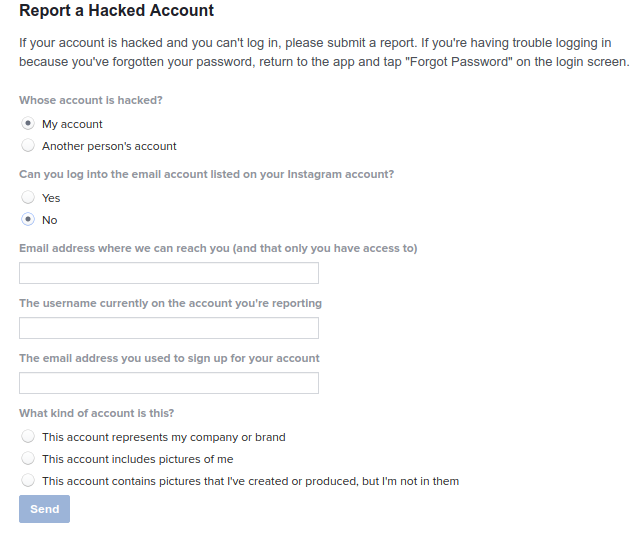
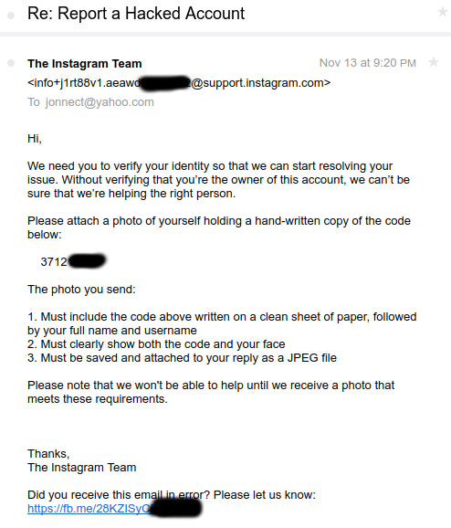

+++
title = "How to “hack” any Instagram account and maybe anyone on Facebook"
description = "During the last month there were some news about “hacked Instagram accounts” of various famous Iranians. By “famous” I mean…"
date = 2016-11-14T17:44:35.093Z
tags = ["facebook", "instagram", "iran", "security", "tech"]
medium = "https://medium.com/@jadi/how-to-hack-any-instagram-account-and-maybe-anyone-on-facebook-7a95e6c5b2a5"
+++

During the last month there were some news about “hacked Instagram accounts” of various famous Iranians. By “famous” I mean Iranian-Cyber-Famous and not International-Hollywood-Famous. Among them one person with enough cyber cautiousness whom hopefully will not fall for normal phishing attacks. So... the question is “how”? My friend Ahmad Takhtdar has an idea and I’m going to explain it to you.

There is a form on Instagram which lets you recover your hacked account. It is located at [https://help.instagram.com/contact/740949042640030](https://help.instagram.com/contact/740949042640030). Using this form you can claim a hacked account back even if you are not able to login into that account and you do not have access to the email used for sign up.

Here is the form:

*I can claim that I’m hacked and have no access not to my account nor to my original email*

Using this form I can claim any account being mine without having any proof. It is enough to have an email address and choosing the “account includes pictures of me” option.

But how it works and how Instagram will be sure that “I” am really the person I’m claiming to be? On the next step, Instagram will send a mail to my **new** email address asking me to take a photograph showing the blah-blah code on a paper and my face visible to the camera. Someone at Instagram will check the code on the paper and will look closely to make sure that the face on the picture is same as the faces on* the claimed to be mine *page. Here is the email I’ve got:

Say I want to *hack* Trump’s account. It is enough to fill the “hacked account form” using my own email address and Trump’s Instagram ID and wait for the email containing the BlahBlah code. Then I need to take a photo of myself with the code and do some Photoshop:

I know this one will not pass the identity check at Instagram but there are people with much better Photoshop skills than me and there are people less famous than Trump out there!

## What about Facebook then?

A couple of years ago, I lost my Facebook password and had no access to my email. Facebook asked me to identify 10 of my friends photos and reset my password! On each question there was a photo of a friend and 5 names and I had to tell Facebook “who is [s]he”. Easy break-in method? Invite 5 friends and ask each of them to search for one the names shown. You will have the profile photo of every “option” and it is easy to tell which one is the one in the mystery photo.

## Solution?

I understand that many people will need this *hacked page form*. I myself might use it one day. But there should be another step between receiving the photo and sending the password reset link. One suggestion is a notification on the app or an email to the email which was used to create the account informing the user about this request. Resetting the password with just a photo of “me” with a sign in “my” hands is ridiculously easy to manipulate specially on site like Instagram.

## Am I wrong? Do I miss something?

Hopefully. I feel bad thinking about how easy it is to high-jack an account. I wish I’m missing something in the above process which prevents people from stealing identities.

Follow me if you can tolerate my bad english :D [jadi]()

---
*Originally published on [Medium](https://medium.com/@jadi/how-to-hack-any-instagram-account-and-maybe-anyone-on-facebook-7a95e6c5b2a5).*
