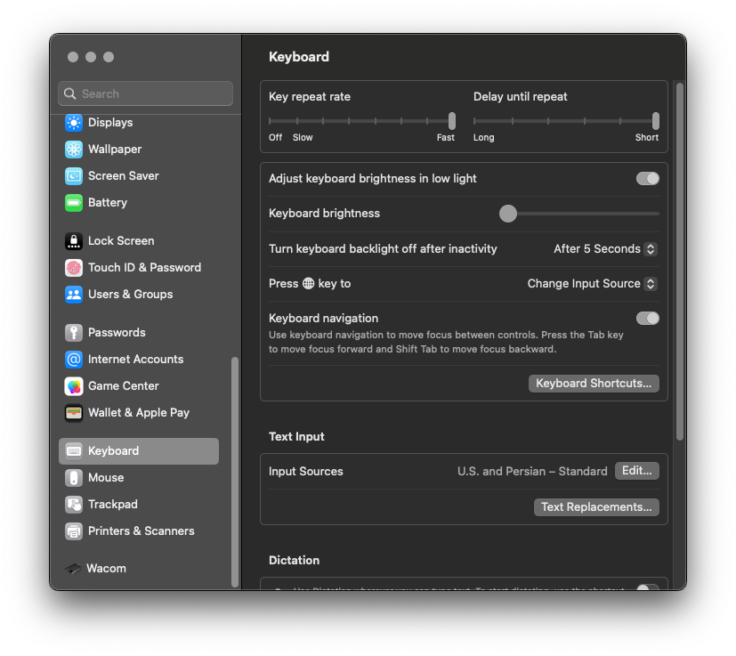
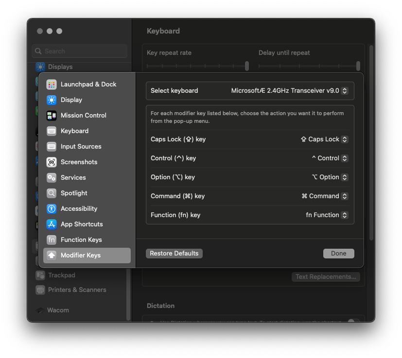

+++
title = "How to remap modifier keyboard keys for Mac OS 2023"
description = "When using a non-mac keyboard on a Mac, your muscle memory will fail on Command & Option modifier keys. On windows we have Ctrl, Windows…"
date = 2023-02-08T09:33:51.331Z
tags = ["mac", "os-x", "tips", "ventura"]
medium = "https://medium.com/@jadi/how-to-remap-modifier-keyboard-keys-for-mac-os-2023-6fed250d9462"
+++

When using a non-mac keyboard on a Mac, your muscle memory will fail on Command & Option modifier keys. On windows we have `Ctrl, Windows (Command), Alt`but on Mac we do have: `Contro, Option, Command (Windows)`.

We used to resolve issue by remapping these key on keyboard settings but on the latest MacOS, its not there anymore! I’ve spent a week with my new MacBook and my old Microsoft Sculpt keyboard before finding where Apple is hiding the setting in 2023 :D

It’s easy, navigate to Settings ~ Keyboard

and click on `Keyboard Shortcuts` . It will give you what you are looking for:

*Changing Mac OS modifier key configs On Ventura 13.2*

Please note that you can make this config separately for each of your keyboards.

---
*Originally published on [Medium](https://medium.com/@jadi/how-to-remap-modifier-keyboard-keys-for-mac-os-2023-6fed250d9462).*
