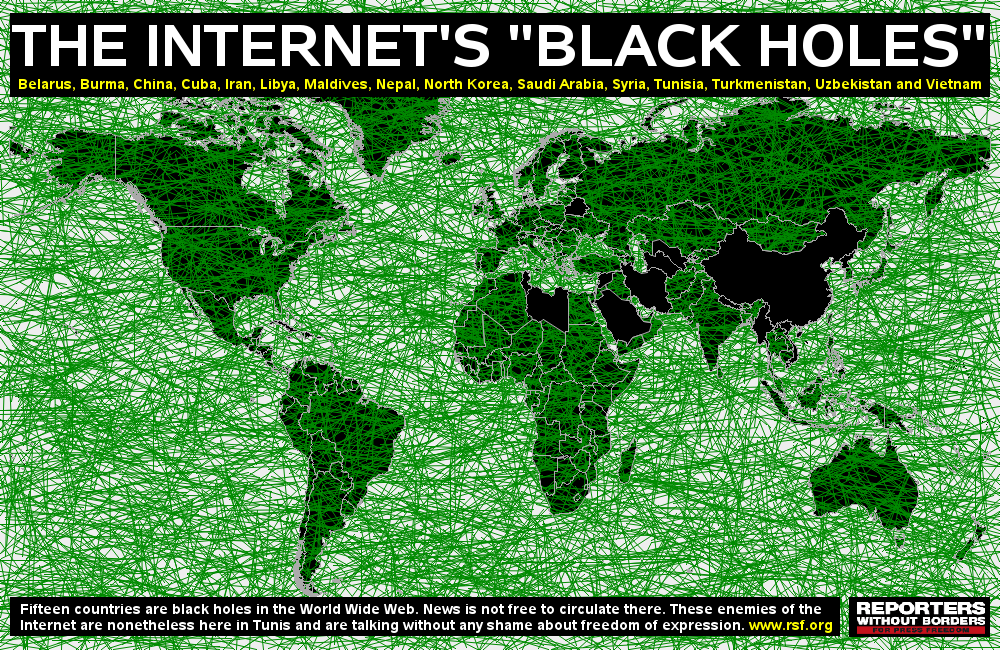
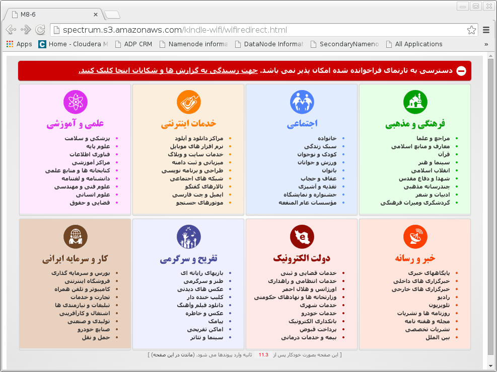

+++
title = "I can not sync my kindle from Iran — anymore"
description = "I love my kindle… or… it is more accurate if I say I love reading books and my kindle is a great solution for this purpose. I live in Iran…"
date = 2015-05-15T06:27:38.412Z
tags = ["amazon", "internet", "iran"]
medium = "https://medium.com/@jadi/i-can-not-sync-my-kindle-from-iran-anymore-3da36aa3b7ce"
+++

I love my kindle… or… it is more accurate if I say I love reading books and my kindle is a great solution for this purpose. I live in Iran — one of the Internet blackholes and a county in which every single book which is going to be published, should be evaluated and certificated by the censors.

*In Iran, censors change books, translations, poems, .. and every publication should have a license from the state and the ministry of Culture and Islamic Guidance*

In this country Kindle is an escape. I can ask a friend of mine in free world to buy my a gift card and I can buy whatever book I want from the Amazon store using it and read them on my Kindle without upsetting the censor.

But it seems the censor is upset and reacting:

## From last night, my kindle is not syncing anymore.

I sent a text file to my kindle email address but its not appearing on the device.

When I connect the Kindle to my home wifi, it tells me that the network need extra login information (which is not true). Then it opens its tiny experimental browser on this address: [http://spectrum.s3.amazonaws.com/kindle-wifi/wifiredirect.html](http://spectrum.s3.amazonaws.com/kindle-wifi/wifiredirect.html) which is blocked in Iran. If I open this in my browser I get:

*Filtering Page in Iran blocks “bad” sites and suggests good ones. After 25 seconds, it forwards you to on of the ProState / StatApprived sites*

This is our Filternet page. If you go to a site which is not approved by the state (including all of the wordress blogs, blogspot blogs, facebook, twitter, youtube, my weblog [http://jadi.net](http://jadi.net), BBC, … ) you will see this page instead and after some seconds (see that countdown which is screenshot at 11.3) if redirects your browser to one of the pro state / state approved sites.

## Solution?

When there is a limitation, there is a solution. The best way is abolishing this censorship which is not feasible at the moment :D While talking about non-feasible solutions, Amazon can also change its URLs ☺

The second one is downloading the books on a computer and copying them to the Kindle using the cable. This way I can not “buy” the books.

And the last one is a pure technical answer. I have to setup an anti-filtering proxy in my home and route my WiFi through it. Whatever devices which connects to this WiFi, will bypass the Iran Filternet automatically as long as Iran does not blocks the filtering technology I’m using.

I was going to read Dj. Patils [Data Driven](http://www.oreilly.com/data/free/data-driven.csp). And its funny how a government does its best to prevent its people from doing so. I always wonder how a country can improve when its state spends B$s on blocking knowledge and access to data.

If you need more info or tests on URLs regargind this, you can reach me at jadijadi on gmail.

---
*Originally published on [Medium](https://medium.com/@jadi/i-can-not-sync-my-kindle-from-iran-anymore-3da36aa3b7ce).*
