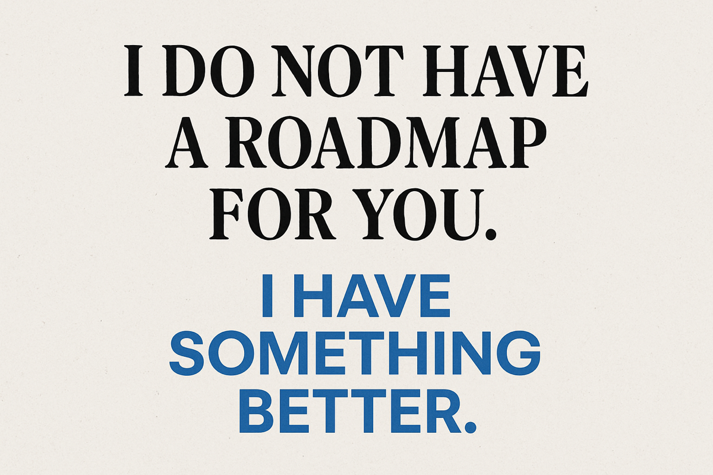

+++
title = "I do not have a roadmap for you; I have something better"
description = "I do not understand roadmaps in computer science. They are cool and fun to look at, but they are HUGE, FRIGHTENING, and they need…"
date = 2025-11-20T04:04:00.907Z
tags = ["computer-science", "devops", "jobs", "linux", "roadmaps"]
medium = "https://medium.com/@jadi/i-do-not-have-a-roadmap-for-you-i-have-something-better-eeb8451b9fd4"
+++

I do not understand roadmaps in computer science. They are cool and fun to look at, but they are HUGE, FRIGHTENING, and they need dedication; I mean long-term… year-long-term dedication.

Instead, I love bite-sized fun things to do. I have 3 hours in my hand this evening. I’m not going to spend it on page 120–128 of that textbook. My style is downloading Grafana and installing it on my computer and checking how it works. Or logging into GitHub, creating an action, and trying to do something with it, or logging into Azure and creating a VM and seeing if I can expand its disk space (is this even a thing? Have to try after posting this and before heading to the pool).

But where do I get these ideas? One of the sources is job postings. When I see a fun, cool job in a company I like, I take a few notes of what they are looking for, and when I have some free time and want to have fun, I check that list.

But you do not know which job you want? So go for the aggregated results like [linux-career-opportunities-in-2025-skills-in-high-demand](https://www.linuxcareers.com/resources/blog/2025/11/linux-career-opportunities-in-2025-skills-in-high-demand/)! It will tell you:

- Docker & K8s
- AWS, Azure, Google Cloud
- Python, Bash, Go
- CD/CD: Jinkins, GitHub Actions
- Monitoring: Prometheus, Grafana, …

Have fun.

---
*Originally published on [Medium](https://medium.com/@jadi/i-do-not-have-a-roadmap-for-you-i-have-something-better-eeb8451b9fd4).*
