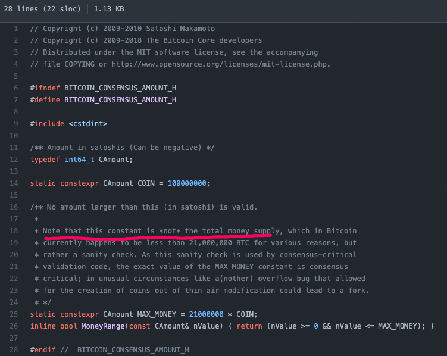
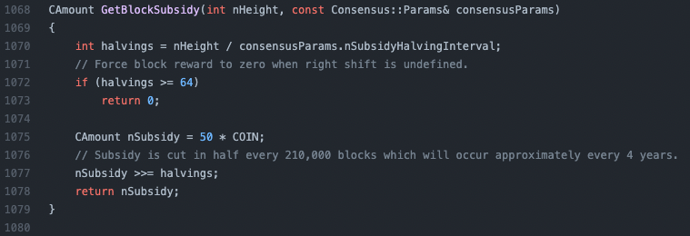
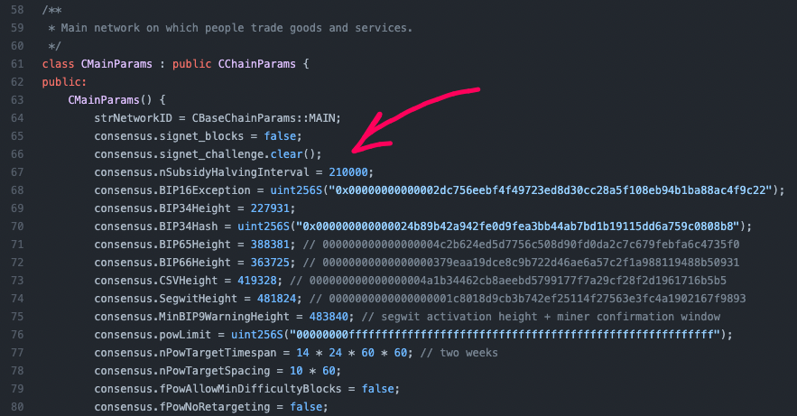
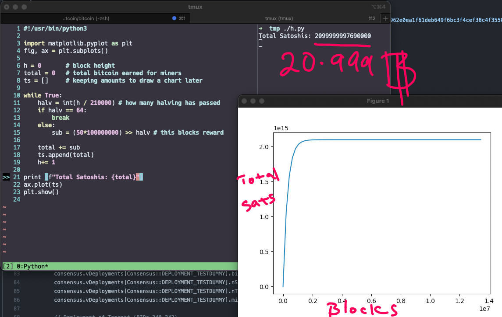

+++
title = "JPMorgan CEO questions 21 million bitcoin cap and Yahoo got it wrong; but YOU shouldn't, lets look…"
description = "Based on this Yahoo story; Jamie Dimon, the CEO of the JPMorgan has challenged Bitcoins 21M cap on Monday, saying:"
date = 2021-10-14T07:25:31.331Z
tags = ["bitcoin", "jp-morgan", "programming", "source-code", "yahoo"]
medium = "https://medium.com/@jadi/jpmorgan-ceo-questions-21-million-bitcoin-cap-and-yahoo-got-it-wrong-but-you-shouldnt-lets-look-ccb1421d6345"
+++

## JPMorgan CEO questions 21 million bitcoin cap and Yahoo got it wrong; but YOU shouldn't, lets look at the source code

Based on [this Yahoo story](https://news.yahoo.com/jp-morgan-ceo-jamie-dimon-questions-21-million-bitcoin-cap-201117274.html); Jamie Dimon, the CEO of the JPMorgan has challenged Bitcoins 21M cap on Monday, saying:

> “I’ll just challenge the group to one other thing: how do you know it ends at 21 million? You all read the algorithms? You guys all believe that? I don’t know, I’ve always been a skeptic of stuff like that,”

Note: I have explained this with some more details in a video:



Not surprising from a Banks CEO but the surprising piece comes afterwards in the Yahoo news when they link to the [consensus/amount.h](https://github.com/bitcoin/bitcoin/blob/master/src/consensus/amount.h) as a proof of 21M Cap in the bitcoin source. This file clearly denies being the proof of “total money supply”:

Although this is kind of acceptable in a general article in an financial site; but lets have a deeper look to the source code and see where this 21M comes from.

Our main clue is in the [src/valudation.cpp](https://github.com/bitcoin/bitcoin/blob/master/src/validation.cpp) file and specifically in this function:

This function is responsible to calculate the block reward; where **nHeight** is the height of the blockchain (at the moment we are trying to mine the nHeight block), COIN is 100M which is the amount of Satoshis in a COIN and the **consensusParams.nSubsidyHalvingInterval** is the Interval in which Halving is happening; which is defined as 210'000 in [chainparams.cpp](https://github.com/bitcoin/bitcoin/blob/3c776fdcec176ffaa2056633fa2b4e737cda29ce/src/chainparams.cpp) :

**can you find where the 2 week difficulty recalculations comes from?**

If we want to calculate the total amount of bitcoin supply, we have to emulate the block creation algorithm (the one that GPMorgans CEO have not checked) and calculate how many coins each single block generates as miners fee (=subsidy) and add them up. A simple python code will do the job:

See? checking the algorithm is easy and reading source codes are doable. Hope you enjoyed and are encouraged to [go check some source code by yourself](https://github.com/explore).

You can fine me on [Youtube](https://youtube.com/geekingjadi), [Twitter](https://twitter.com/@linux1st).

---
*Originally published on [Medium](https://medium.com/@jadi/jpmorgan-ceo-questions-21-million-bitcoin-cap-and-yahoo-got-it-wrong-but-you-shouldnt-lets-look-ccb1421d6345).*
