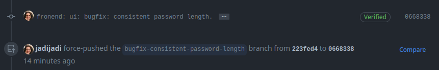

+++
title = "Sign your git commits, no-nonsense ! without “intro”, “why” & …"
description = "I’m not going into “why you should sign” and blah blah to make this post longer. Most people are here because they needed to sign their…"
date = 2023-08-16T07:39:30.822Z
tags = ["git", "programming", "signing", "sysadmin"]
medium = "https://medium.com/@jadi/sign-your-git-commits-no-nonsense-without-intro-why-b5094bb4b425"
+++

I’m not going into “why you should sign” and blah blah to make this post longer. Most people are here because they needed to sign their commits and they searched (mainly my self future!).

First, check your keys. Signing with SSH keys is easier because most people already do have their ssh keys & are using them to login into the github. So check the `~/.ssh/` directory for a pair of `id_rsa` and `id_rsa.pub` (or any other format of the key you have).

Second, tell the `git` command to use them for signing. In my case it would be:

```
git config --global gpg.format ssh
git config --global user.signingkey /home/jadi/.ssh/id_rsa.pub
```

Obviously your directory will be different and you may want to omit the `--global` to set the configuration only for the project you are in.

Next, sign your `commit`s with the `-S` switch:


```
git add this_file that_file
git commit -S -m 'This is a signed commit'
```

> you already have a commit and you need to sign it? use the `commit --amend -S`

Last step is adding this **signing key** to your github account. Go to the [https://github.com/settings/keys](https://github.com/settings/keys), add the public key (so `/home/jadi/.ssh/id_rsa.pub`) in my case and save it as a **signing key**. This will lead to a verified badge near your signed commits.



Done.

> You never upload/use the `id_rsa` file directly; thats why it is called the **private** key. Be careful, only share the `.pub` file unless you know exactly what are you ding.

---
*Originally published on [Medium](https://medium.com/@jadi/sign-your-git-commits-no-nonsense-without-intro-why-b5094bb4b425).*
