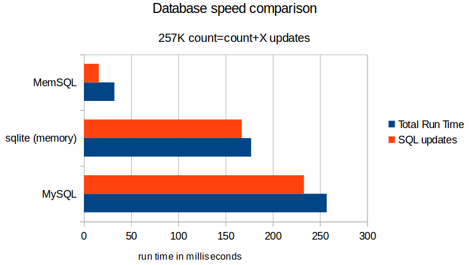

+++
title = "How switching to MemSQL made my day"
description = "A profiled test-drive of MemSQL on my update-intensive python code"
date = 2015-04-01T16:07:11.535Z
tags = ["big-data", "data-science", "programming"]
medium = "https://medium.com/@jadi/switching-to-memsql-made-my-day-4a6a3ab287b9"
+++

I’m a programmer and these days using Python for a data consolidation task on millions of rows of data. My code reads all the data from a sqlite database, creates the required output table filled with zeros and then checks the input row by row and add to the counts on the required cells of the output table. In the reality I work with SMSs but assume I’m working with fruits to prevent a NDA complain filled by my boss against me. My initial table is filled with 0s and have a lot of rows and columns like this:

Then by parsing the input stream line by line, I look at my data, count the input and update the table. Say after seeing an Orange on March 31th, I’ll update my table to this:

After a while I will have something like this:

Please note that I’m using CPU expensive

> UPDATE aggdb SET count=count+NEWDATA where DATE = thisDATE

SQL commands and that is the main bottleneck of my codes performance.

I started with the MySQL and this is the result of cProfile:

> jadi@manipc:~/sms/$ **python -m cProfile ordlc.py **#MySQL 16083556 function calls (16083023 primitive calls) in **257.195** **seconds**

> Ordered by: standard name

> ncalls **tottime** percall cumtime percall filename:lineno(function) 257753 **233.015** 0.001 233.015 0.001 {method ‘query’ of ‘_mysql.connection’ objects}

As you can see the total run takes 257s from which, 233s is spent by SQL updates. Then I tried sqlite in-memory DBs. They are not designed for performance but still improved the situation.

> jadi@manipc:~/sms$ **python -m cProfile ordlc.py **#sqlite in-memory db

> 11122033 function calls (11121552 primitive calls) in **177.187 seconds**

> Ordered by: standard name

> ncalls **tottime** percall cumtime percall filename:lineno(function) 257751 **167.129 **0.001 167.129 0.001 {method ‘execute’ of ‘sqlite3.Cursor’ objects}

This is good but still slow. I searched for newSQL solutions and landed on MemSQL and VoltDB.

[MemSQL - Wikipedia, the free encyclopedia](https://en.wikipedia.org/wiki/MemSQL)

MemSQL claims to be the world’s fastest in-memory database and it is very easy to run. So I installed it on the same machine which runs the scripts. It is a Pentium i3 with 4GB of ram running Ubuntu 14.10. This is the results:

> jadi@manipc:~/sms$ **python -m cProfile ordlc.py **#MemSQL 16083536 function calls (16083003 primitive calls) in **32.396** seconds

> Ordered by: standard name

> ncalls **tottime** percall cumtime percall filename:lineno(function) 257752 **15.892** 0.000 15.892 0.000 {method ‘query’ of ‘_mysql.connection’ objects}

Wow! An astonishing 87% improvement on the total execution time in the total run time and 93% improvement on the ~250K updates!

*Comparing the speed of MemSQL, sqlite in-memory databases and MySQL*

And the best part? MemSQL is 100% compatible with MySQL APIs so I did not need to change even 1 line of code on my software and only needed to get a license from [http://www.memsql.com/download/](http://www.memsql.com/download/) and install MemSQL on my machine instead of MySQL.

I have to admit that MemSQL did a magic in my full-of-expensive-sql-updates case. Let me finish this with a classic Pros vs Cons section.

## Pros

1. 100% MySQL code compatibility makes *switching* to MemSQL as easy as installing MemSQL
1. Extremely FAST. My profiling shows +90% improvement over MySQL in my case. I know that these two are designed with two totally different ideas but when you need speed, MemSQL is the answer.
1. Easy to scale. Although at the moment I’m using it on only one machine, but tested the same code on a 3 machine MemSQL deployment and worked great

## Cons

1. It is not a free software. I respect the programmers right for licensing their code as they wish but as a FOSS enthusiastic, prefer the FOSS software when possible. In addition I’m from Iran and 1) under embargo 2) have no access to international credit cards. This makes purchasing a license out of my hands
1. The MemSQL site does not mentions the pricing. If I’m going to use it on only one machine as a lightning fast temporary database for my data aggregation task, I prefer to know beforehand if it is going to be free on one machine or will cost me 10K a year.
1. It makes programmers lazy ;) I do not need any other optimization on my code! Just kidding! This is the BEST part and this should come in Pros section.

---
*Originally published on [Medium](https://medium.com/@jadi/switching-to-memsql-made-my-day-4a6a3ab287b9).*
