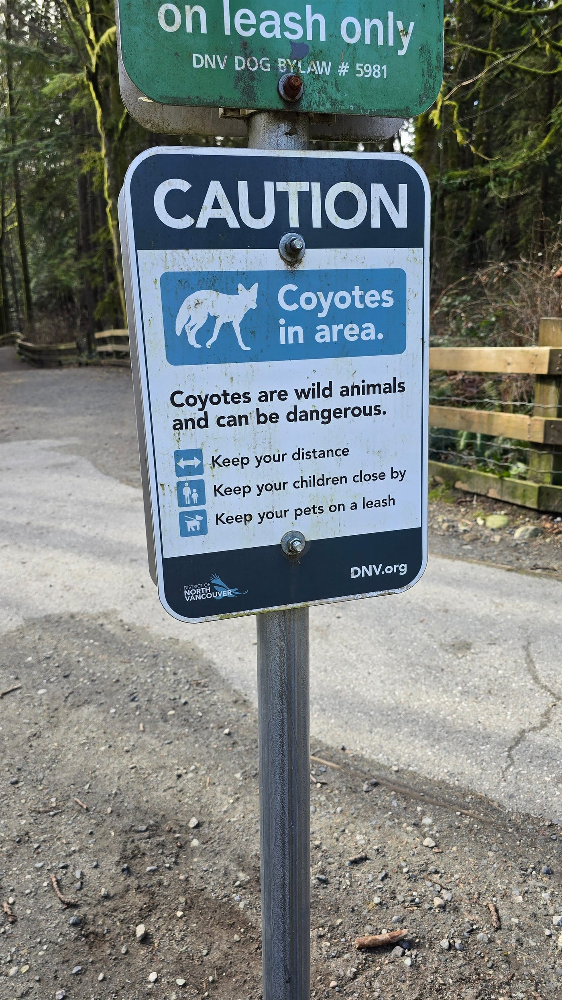

+++
title = "The Internet Is Becoming the Street With Checkpoints"
description = "A thought experiment about freedom, risk, and control"
date = 2025-12-17T23:06:31.029Z
tags = ["age-verification", "censorship", "freedom", "human-rights", "totalitarianism"]
medium = "https://medium.com/@jadi/the-internet-is-becoming-the-street-with-checkpoints-35806b037b56"
+++

*sorry for semi unrelated image. I had to had an image and do not want AI in my posts*

I’ve been robbed on the street. There are sex predators walking on the sidewalk. You might fall while trying to jump over a canal. I’ve even heard about shootings and knife attacks. Streets are dangerous, so why not pass a law stating that everyone stepping outside their home must show ID and fill out a form explaining where they are going, why they are going there, and for how long? This would surely make our streets much safer — although, of course, things could still happen. And naturally, people under 18 wouldn’t be allowed on streets the state considers harmful.

Silly? Totalitarian? Non-functional? Counter-productive? Yes to all of the above. And on top of that, it wouldn’t even help much with crime rates. Violent crimes still happen in prisons, where everyone is known, constantly watched, and prevented from carrying anything remotely dangerous.

Now think about the internet and the laws currently being proposed. Age restrictions. Identity checks. It’s not a perfect analogy, but both point in the same direction. Once you allow the state to “age-check” you on porn sites (read: identify everyone, record everything they do forever, and share it with whoever they want), why wouldn’t they require age checks on Reddit…

> **Note:** this post is member-only on Medium, so only the preview could be imported. The full text is on Medium.

---
*Originally published on [Medium](https://medium.com/@jadi/the-internet-is-becoming-the-street-with-checkpoints-35806b037b56).*
