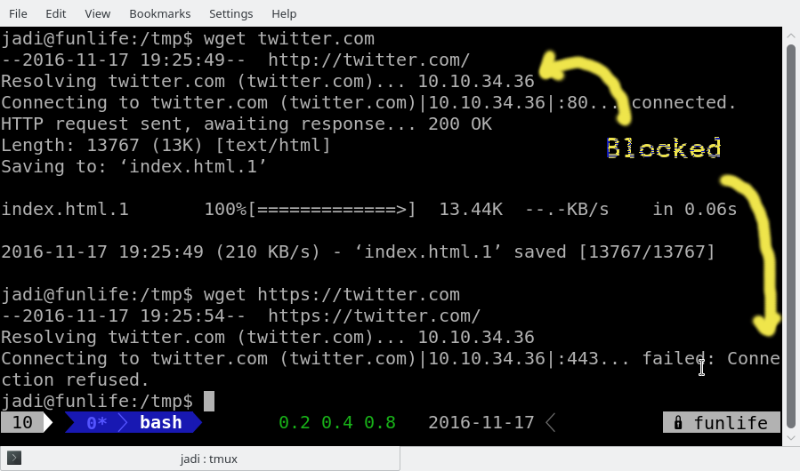
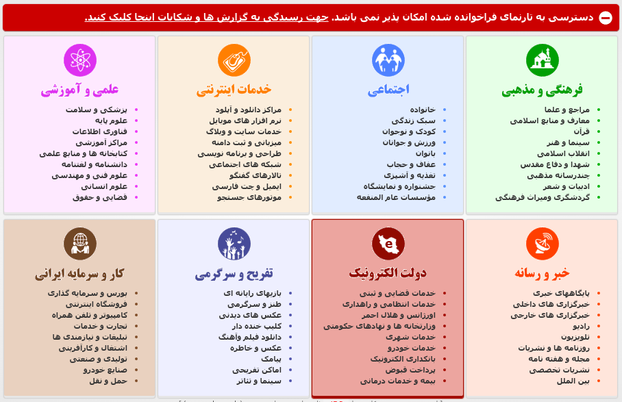
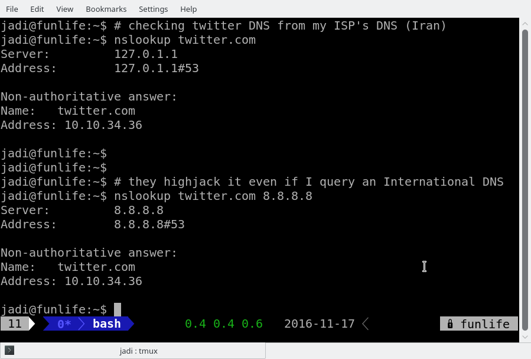
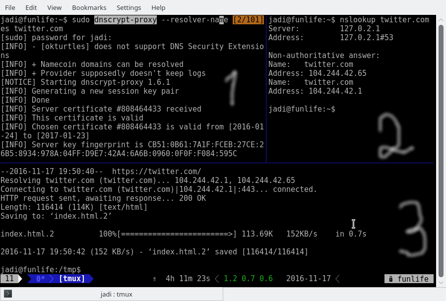

+++
title = "Twitter is still blocked in Iran, on DNS level"
description = "Twitter has a strange condition in Iran. It is blocked on our Filternet (that is how we call the Internet!) but at the same time many…"
date = 2016-11-17T16:58:28.733Z
tags = ["censorship", "internet", "iran", "security", "twitter"]
medium = "https://medium.com/@jadi/twitter-is-still-blocked-in-iran-on-dns-level-433835e5aff6"
+++

Twitter has a strange condition in Iran. It is blocked on our Filternet (that is how we call the Internet!) but at the same time many officials do have twitter accounts; including the Leader, the president, some of the ministers, some parliament members, Tehran’s municipality and many others. Last week one of the *reformist* parliament members started tweeting about “why the Twitter is Blocked?” and asked followers to provide him some reasons on “why the state should unblock the twitter”. He claimed that he want to try his chance unblocking twitter!

And today… some people said that they can use twitter without circumvention tools such as VPNs and TOR.

> Seeing some sites open and free from the state censorship is nothing new. All computer systems break time to time.

In my opinion the “free twitter” was just a technical mistake this morning. At the moment it is blocked for me again:

*twitter is blocked in Iran*

As you can see when I query the IP of the twitter.com, the DNS which is set on my ISP (Shatel) gives me 10.10.34.36. This is in *invalid* IP and blocks all access toward the real Internet and just displays our censors page. Same thing happens even if I explicitly tell my resolver to use 8.8.8.8. The censor is intercepting my DNS query, not liking the twitter and re-routing me toward its damn censorship page:

*Iran shows this page when you try accessing blocked sites. You will be forwarded to a state-approved-site after 30 secconds*

This blocking is happening both on http and https protocols. Technically the connection is not intercepted; only the DNS (when the twitter.com is going to be translated to the correct IP of twitter’s servers). Lets have a look:

As you can see, the censor hijacks the DNS request and forwards my computer toward its dirty censorship page (shown before the above screenshot).

But what happens if I install DNSCrypt and encrypt my DNS queries; hiding them from the censor?

*1. Install DNSCrypt and run it, 2. now twitter.com is resolved to the correct IP, 3. I can reach twitter.com correctly*

In above screenshot I have 3 sections in my terminal. On section 1, the DNSCrypt is running. This program encrypts my DNS queries. On section 2 you can see that twitter is being resolved to the correct IP and having this IP, my computer can reach the twitter correctly when I’m trying it on section 3. Now I can reach twitter on my browser without using any further anti censorship tool.

---
*Originally published on [Medium](https://medium.com/@jadi/twitter-is-still-blocked-in-iran-on-dns-level-433835e5aff6).*
