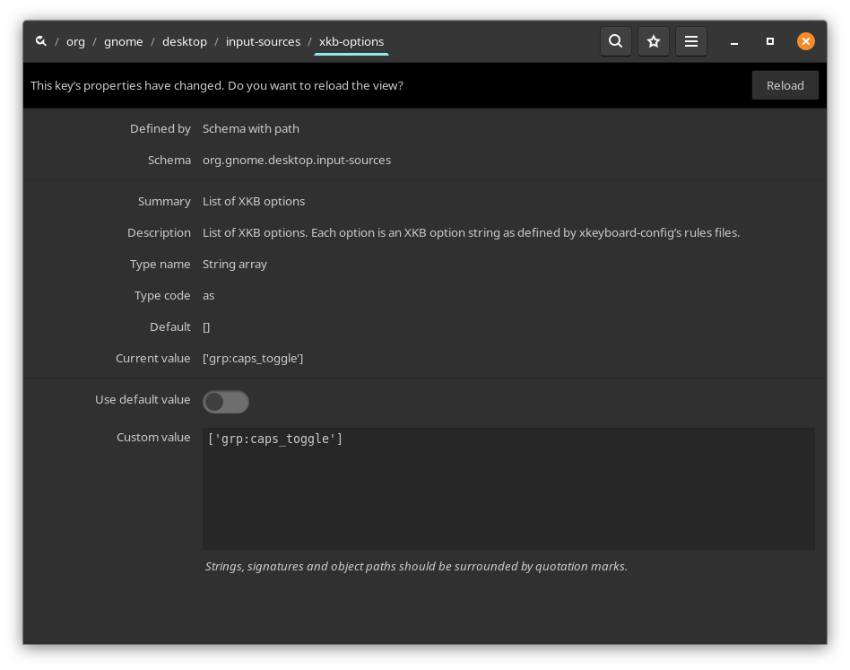

+++
title = "use Caps Lock to change keyboard layout in gnome / pop-os / .."
description = "if you are using any of the Gnome or its variants under distros like Ubuntu, Pop-OS and other and prefer to use the Caps Lock key to…"
date = 2023-06-22T13:11:19.218Z
tags = ["caps-lock", "gnome", "keyboard-layout", "linux", "pop-os"]
medium = "https://medium.com/@jadi/use-caps-lock-to-change-keyboard-layout-in-gnome-pop-os-c6bde45ce901"
+++

if you are using any of the Gnome or its variants under distros like Ubuntu, Pop-OS and other and prefer to use the `Caps Lock` key to change the keyboard layout to another language, there is a way.

First install the `dconf-editor` :

```
sudo apt install dconf-editor```
```

and then run it. Then go to the below path:



and update the `custom value` to:

```
['grp:caps_toggle'] 
```

Done.

---
*Originally published on [Medium](https://medium.com/@jadi/use-caps-lock-to-change-keyboard-layout-in-gnome-pop-os-c6bde45ce901).*
